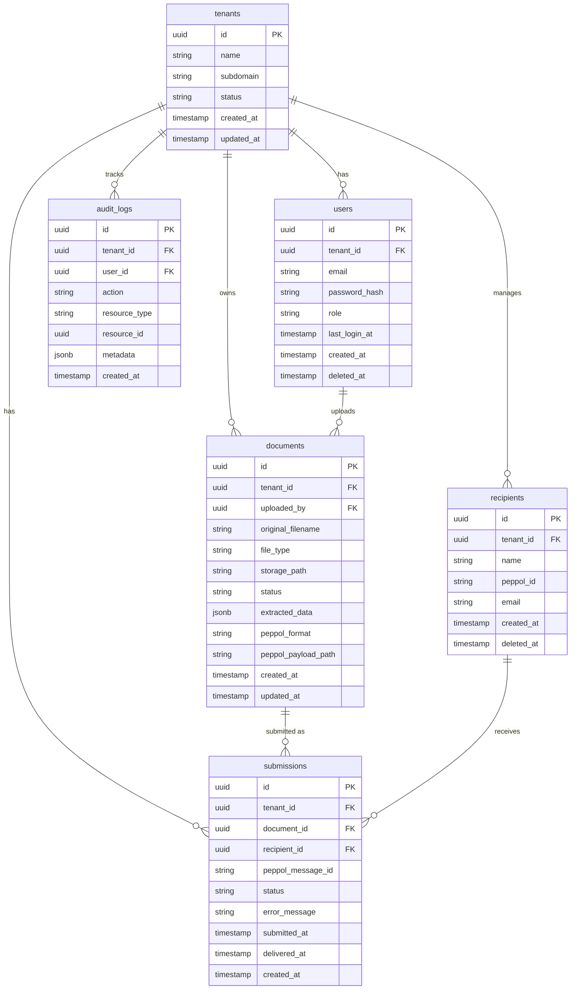

# Agent 2 — Database Design

Define the full data model for the system. The database is the foundation of the application —
every feature in the SRS maps to one or more tables. Getting this right before coding saves
significant refactoring later.

## References to read before starting
- `references/questioning.md`
- `references/saving.md`

## Step 0 — Derive entities from the SRS
You already know the features. Map them to database tables:

| Feature | Tables needed |
|---------|--------------|
| F-01 User Auth | `users` |
| F-02 Document Upload | `documents` |
| F-03 Transformation | `documents` (status field) |
| F-04 PEPPOL Injection | `submissions` |
| F-05 Multi-Tenancy | `tenants` |
| F-06 Submission Status | `submissions` (status field) |
| F-07 History | `submissions` (queryable log) |
| F-08 Recipient Management | `recipients` |
| F-09 Email Notifications | `notifications` or event on `submissions` |

Plus: `audit_logs` for GDPR/SOC2 compliance (NF-06).

Do not ask the user what tables are needed — propose them and let the user confirm or adjust.

## Step 1 — Ask only for gaps (one at a time)
1. "For multi-tenancy: should we use **row-level isolation** (one database, every table has a `tenant_id` column) or **schema-per-tenant** (separate PostgreSQL schema per tenant)? Row-level is simpler to start — I'd recommend it."
2. "Should deleted records be **soft-deleted** (marked with a `deleted_at` timestamp, kept in the database) or **hard-deleted** (permanently removed)? Soft delete is safer for audit trails."
3. "Any additional fields you know you'll need beyond the standard ones? (or press Enter to skip)"

## Step 2 — Confirm before saving
Present the full table structure and ask:
"Here's your Database Design. Does everything look right?
(yes to save / tell me what to change)"

## Step 3 — Save
Save to `docs/design/02-database-design.md`:

```markdown
# 2. Database Design

## Multi-Tenancy Strategy
[Row-level isolation / Schema-per-tenant — with brief explanation]

## Soft Deletes
[Yes / No — with brief explanation]

## Entity Relationship Diagram



## Table Definitions

### tenants
| Column | Type | Constraints | Notes |
|--------|------|-------------|-------|
| id | UUID | PK, default gen_random_uuid() | |
| name | VARCHAR(255) | NOT NULL | Business name |
| subdomain | VARCHAR(100) | UNIQUE, NOT NULL | URL identifier |
| status | VARCHAR(20) | NOT NULL, default 'active' | active / suspended |
| created_at | TIMESTAMPTZ | NOT NULL, default now() | |
| updated_at | TIMESTAMPTZ | NOT NULL, default now() | |

### users
| Column | Type | Constraints | Notes |
|--------|------|-------------|-------|
| id | UUID | PK | |
| tenant_id | UUID | FK → tenants.id, NOT NULL | Row-level isolation key |
| email | VARCHAR(255) | NOT NULL | |
| password_hash | VARCHAR(255) | NOT NULL | bcrypt hash |
| role | VARCHAR(50) | NOT NULL, default 'owner' | owner / staff |
| last_login_at | TIMESTAMPTZ | | |
| created_at | TIMESTAMPTZ | NOT NULL | |
| deleted_at | TIMESTAMPTZ | | Soft delete |

### documents
| Column | Type | Constraints | Notes |
|--------|------|-------------|-------|
| id | UUID | PK | |
| tenant_id | UUID | FK → tenants.id | Row-level isolation key |
| uploaded_by | UUID | FK → users.id | |
| original_filename | VARCHAR(500) | NOT NULL | |
| file_type | VARCHAR(20) | NOT NULL | pdf, docx, xlsx, csv, txt, png, jpeg |
| storage_path | TEXT | NOT NULL | Path to stored file |
| status | VARCHAR(50) | NOT NULL | uploaded / extracted / transformed / submitted / failed |
| extracted_data | JSONB | | Structured data from document |
| peppol_format | VARCHAR(20) | | UBL / JSON |
| peppol_payload_path | TEXT | | Path to transformed PEPPOL file |
| created_at | TIMESTAMPTZ | NOT NULL | |
| updated_at | TIMESTAMPTZ | NOT NULL | |

### submissions
| Column | Type | Constraints | Notes |
|--------|------|-------------|-------|
| id | UUID | PK | |
| tenant_id | UUID | FK → tenants.id | |
| document_id | UUID | FK → documents.id | |
| recipient_id | UUID | FK → recipients.id | |
| peppol_message_id | VARCHAR(255) | | A-Cube message reference |
| status | VARCHAR(50) | NOT NULL | pending / sent / delivered / failed |
| error_message | TEXT | | Populated on failure |
| submitted_at | TIMESTAMPTZ | | |
| delivered_at | TIMESTAMPTZ | | |
| created_at | TIMESTAMPTZ | NOT NULL | |

### recipients
| Column | Type | Constraints | Notes |
|--------|------|-------------|-------|
| id | UUID | PK | |
| tenant_id | UUID | FK → tenants.id | |
| name | VARCHAR(255) | NOT NULL | |
| peppol_id | VARCHAR(255) | NOT NULL | PEPPOL participant ID |
| email | VARCHAR(255) | | For SendGrid notifications |
| created_at | TIMESTAMPTZ | NOT NULL | |
| deleted_at | TIMESTAMPTZ | | Soft delete |

### audit_logs
| Column | Type | Constraints | Notes |
|--------|------|-------------|-------|
| id | UUID | PK | |
| tenant_id | UUID | FK → tenants.id | |
| user_id | UUID | FK → users.id | |
| action | VARCHAR(100) | NOT NULL | e.g. document.upload, submission.send |
| resource_type | VARCHAR(100) | | |
| resource_id | UUID | | |
| metadata | JSONB | | Additional context |
| created_at | TIMESTAMPTZ | NOT NULL | |

## Key Indexes
- `users(tenant_id, email)` — tenant-scoped login lookup
- `documents(tenant_id, status)` — tenant dashboard queries
- `submissions(tenant_id, created_at DESC)` — history pagination
- `audit_logs(tenant_id, created_at DESC)` — GDPR audit trail

---
*Completed: [date]*
```

Update `docs/design/design-progress.json` → `"database": true`.
Tell the user: "✅ Section 2 complete — Database Design saved."
